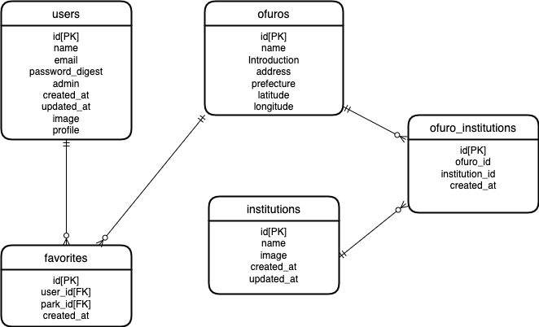

# README

# 開発言語
* Ruby3.0.1
* Rails6.1.7

<br>

# 就職Termの技術

* ec2
* お気に入り機能


<br>

# カリキュラム外の技術
* gmaps4rails

<br>

# 実行手順
```
$ git clone git@github.com:idesho/Oshisen_Kawasaki.git
$ cd Oshisen_Kawasaki
$ bundle
$ rails db:create && rails db:migrate
$ rails s
```

<br>

# カタログ設計,テーブル定義書
https://docs.google.com/spreadsheets/d/1DlzgyfpTOnBQto6i_F5fZoG28kJTXDywKmAxUsBAAew/edit?usp=sharing
<br>

# ワイヤーフレーム

<br>

# ER図


<br>

# 画面遷移図
