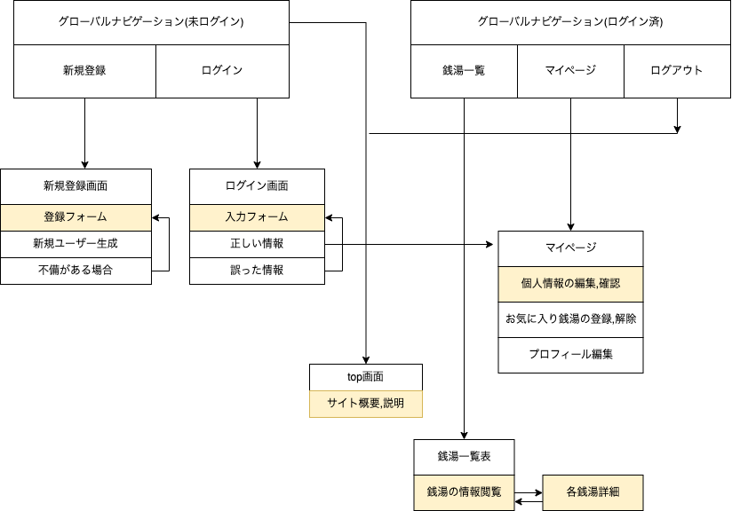

# README

# 開発言語
* Ruby3.0.1
* Rails6.1.7

<br>

# 就職Termの技術

* ec2
* お気に入り機能


<br>

# カリキュラム外の技術
* gmaps4rails

<br>

# 実行手順
```
$ git clone git@github.com:idesho/Oshisen_Kawasaki.git
$ cd Oshisen_Kawasaki
$ bundle
$ rails db:create && rails db:migrate
$ rails s
```

<br>

# カタログ設計,テーブル定義書
https://docs.google.com/spreadsheets/d/1DlzgyfpTOnBQto6i_F5fZoG28kJTXDywKmAxUsBAAew/edit?usp=sharing
<br>

# ワイヤーフレーム
https://viewer.diagrams.net/?tags=%7B%7D&highlight=0000ff&edit=_blank&layers=1&nav=1&title=%E3%83%AF%E3%82%A4%E3%83%A4%E3%83%BC.svg#R%3Cmxfile%3E%3Cdiagram%20name%3D%22%E3%83%A1%E3%82%A4%E3%83%B3%E3%83%9A%E3%83%BC%E3%82%B8%22%20id%3D%22c9db0220-8083-56f3-ca83-edcdcd058819%22%3E3ZZNc5swEIZ%2FjY7xIAQYjoBJeujHTN2v6U0BAZoA8shysPPrK%2BTFQAzTJNPJoVwsvSvtWvusFhCJ6%2BOdpLvyk8hYhWwrOyKyQbaNHZ%2Fon045nRXf8s9CIXkGiwZhy58YiBaoB56x%2FWShEqJSfDcVU9E0LFUTjUop2umyXFTTqDtasCthm9KqV1fuoP%2FkmSrhHLY36B8YL8o%2BNvaCs%2BWepg%2BFFIcGIjaiYWdLTXs3cMp9STPRjiSSIBJLIdR5VB9jVnWJ7XPW71On%2Fo8iEpWqrvQE66Ex3y5sxi%2FZrA8mWaPG4Zb8kWztUZ%2By3MncNMD4BgI80urQB3gecRTucnhLTzK6L1kGE23ZdevrY9FV1%2BpeJ2Sv9HAlDeso51UVi0pI45TY5uk2KikeWG8xiSdRW3LFtjuadi5b7UVrBs8lXi4aBSWIbZiP3Fvm0TqteNFoLdUJYnI2Y30KmFTsOJIgg3dM1EzJk14C1h4p3JM1TNuh5DB2QSxH9eaARqHQi4vngZgeALR5gI%2BH7%2FUP5wuJv7lP7edN%2Ffsr%2F3XjXUNMCNL3OdyYgY0iCwahA6aIvA30mCPQmkX494KYEgvMs8B%2BgdCU43xtL1LEFnHnwL0jN0xmwHko8AwvH4Ue8m9RskY6MVGEkgD5MYreeEP%2FG3CBM3vh3pObM8NtjSIHRQFKnI6VHxluDnALNij8950VgEhohO4iUiP2r0R83Y2JQ0LHumabm2eB7VVr7TBz%2FT4OwVDzLKtMfL2RN8VHlqtx%2B4ZEPG%2Fn3rADDvWiKnpVz8bzNTTTtNfe66tIT4cPAmMbfXKR5A8%3D%3C%2Fdiagram%3E%3Cdiagram%20id%3D%22vIhInbRgr741aCmmTpXr%22%20name%3D%22%E3%83%AD%E3%82%B0%E3%82%A4%E3%83%B3%E3%83%9A%E3%83%BC%E3%82%B8%22%3E7Zhbb9owGIZ%2FjS%2BLkjjHSxLCdjMJhLqpV5WbmMSaEzPHFOivn5M4pwYE3QBNU32D%2Fdrx4XvezwEADLL9F4426TcWYwoMLd4DOAOGoZsulB%2BlcqgVV3NrIeEkVoM6YUXesBI1pW5JjIvBQMEYFWQzFCOW5zgSAw1xznbDYWtGh6tuUIJHwipCdKz%2BILFI1SkMp9O%2FYpKkzcq67dU9GWoGq5MUKYrZrifBEMCAMybqWrYPMC2D18Slfm5%2BorfdGMe5uOSBVejNng%2FzX%2BSJ0qdHK3pbWI8PusLziuhWnTjMECmfQ3HMcVGozYtDE5E1oTRglHHZzFkuVb8QnP3E70RESZLLJsVruT9%2FzXKh8OqmbKt1MRd4f%2FJEehsnaTDMMiz4QQ7ZdSQMW4U37VEwlcYxRYK8DlEi5Yikna9dYsGIXNnQ1IYacsq6rSebGdh6XWDRD7qs9DbaSRWKj2AxR1hGHFKR0TKYZfwba2myEaMixbFqyJ5NOT7bJ2V%2BTl6k3SQttJlwXqWLzxUUq2R0Di0woFeVMd9igyKSJ%2BWOrCO4y3ZvFjtwbGd2PRu42hEbwOvYoIHR2MC6nw3skQ0WqCh2jMefadnwgHdMS%2BczLf%2FVtIR3TEtvbIMQAvlVZzqrKgbwNVWZmqrLh%2Fe2iuSpaa41D85dBZEkivl5d8yrcj13OLe7I6AzvCRMeAt3LN3lYRsuA%2F7dgXYSTff58%2FRBv%2F0dUXN%2Fx9qoyinWu5QIvJKXQTnlTs5SGodt87hdrw%2FfGMPXqnLMNX%2FjBoWneVucuzpM7bQRBhw%2FCs24Y0Zf%2BqY%2Bb4AhofYVcIz1RZBO%2B3lMTs3iGMfQ3ZHc%2BAcMCG3g2RUwF0xt4M5B6AAZGd8HoQfcAPh%2FmJL%2FFTnbghNPh5oJTceVGejdiqNsdr9y61u2%2B68Ahr8B%3C%2Fdiagram%3E%3Cdiagram%20id%3D%2212HrpW373zZyDdCBRZGQ%22%20name%3D%22%E6%96%B0%E8%A6%8F%E7%99%BB%E9%8C%B2%E7%94%BB%E9%9D%A2%22%3E7Zldb5swFIZ%2FjS9Xgc3nZSCkvammLRfbLp3ggFXAyDhL2l8%2Fm5gk1ETJoiTVuqCqwscf2O9zXhtagOJy%2FchxnT%2BzlBQAWukaoDGAMHQ8%2BVsFXjcBrwtknKabkL0LTOkb0UFLR5c0JU2voWCsELTuB%2Besqshc9GKYc7bqN1uwov%2FUGmfECEznuDCjP2gq8k00gP4u%2FkRolndPtr1wU1PirrFeSZPjlK32QigBKOaMic1duY5JobTrdNn0mxyo3U6Mk0qc0mHcTH8W8fT708IqIstqnBlrvribUX7jYqkXnJSYFnrG4rWTYUGLImYF47JYsUpGo0Zw9kLeBXFBs0oWC7KQk4oWrBKaqe3octcDQARt6MJQxvUsCBdkfXB59lY0mWyElUTwV9lEd4CW1lknGkK6vNphc7o2%2BR6yrh3WmZJth96JKW%2B0nn%2BhrWdoa8iai7JQ2ig5u%2FSwZCHFTU5SXZA1tWpfrjNlsYeZTBkpPq4fOG9TPuJaY1dJfIyU1D1sLxNXU%2BM5rTI1I%2Fc4PS%2F2PX98HXqOM0DPviU936BX0flLhUvyD5rDDvvywiF5b2qO4G6Os80Bg482R2ia43MYw%2FZMaVF4S2k7jndnnOMM66OdYZvWuOM7%2BZ1twH23xdetYQ9fo8SC1rK%2BNUcptmUF7iQ%2Btm3OpdyEH0c3aa%2FLoEOu20Pneq6Bzh8g51yNHDTI1bhpVoynBji5bCX8Hj9DSiUOlZ%2BBI11R0jRV3SNOGvqGZ%2B1Qim%2FNaCXaxbgRcJUx8FKwRlM4hG7Ar1c4zbbeOQLlenZC993w7N3QHaB3493QMfElCARQ%2FagbGwQeSBwQBUC%2BkyYuiEZg5P2%2Ffht4Mb%2BW37LnxbeymTw2bAJ%2FjbKvbyKcfTFPr4vbbeO2d%2BcUbK9D4q9yKshU%2BkoNuZKjKKxsWaXb5%2B27DJous9prKG0uYrs%2BQxNhMPRlfImDbJCheY61VkNgNNbmiyx9M3J0VYTO43zqB9rxfOgD226uQ%2BhPYnY4vQ%2BC9OEQuhuSGzjsEg%2BEXgssUBtjMAGJD6QyUQSSEAQxiM506Kci57noIbSR5SDHD6BnhdfiKIu7P7i3dXv%2FtUDJHw%3D%3D%3C%2Fdiagram%3E%3Cdiagram%20id%3D%22akoSDz7HcMsowmoLQ148%22%20name%3D%22%E3%83%9E%E3%82%A4%E3%83%9A%E3%83%BC%E3%82%B8%22%3E7Vhbb9s2FP41BLaHBKKo66Nky90ehhXIhqJPhWzRkjZJ9Gi6dvbrd0iRsmVRTdrFKQpEAWLqkDwkz%2FedC4XIoj294%2Fmu%2Bo0VtEGuU5wQWSLXjb0A%2FkvBYy8IjKDkddGL8FnwUP9LtdDR0kNd0P1ooGCsEfVuLNywrqMbMZLlnLPjeNiWNeNVd3lJJ4KHTd5MpR%2FqQlS9NHLDs%2FwXWpeVWRkHcd%2FT5mawPsm%2Bygt2vBCRDJEFZ0z0rfa0oI20nbFLP2810ztsjNNOPGfCH%2Bm7Ja8%2Bfvr0V3lIPrwP%2FnTE73day%2Be8OegD682KR2OBSrQNtDAi6XAEB16KfF%2FRQr9Az06Ob0%2BlpMH9Go61F9C85wqVdFs3zYI1jCulxFWPnCg4%2B5uano51oCU9VrWgD7t8I1UeQQvIODt0xbDelnVCkwW7%2Bv1CvaMekOdNXXYg24CRKHSm%2BryUC3qaNSQe4AFaU9ZSwR9hiJ5gANWM9vTr8YIejpZVF9Qw43LNyHJQfAYNGhq3r8DQnWKYERQRlCxVw0WpoxuJaxqBHhNF3wb4JZ4aNSuUTxNjjFysnhkOPAu8eZ7PIhq6NgxfEcJgDsI4M4B5RpLoRrow6L5BCHnF%2F84QhhYIYxQlygsDlMYoWaHMk2jBvrJIumASviHn%2BtF3Ri66fQ7U5uY6ZfkTwMD4y5X8g56LxWw4XGXSrXq%2BkAIlYjUUNIlOhWsmBGttuXEPC9VdCSL3Osd6L5M6%2FXHqxHgKfRDbsPece%2F9G8McT%2BH9tZVEINSXY%2B4WZINguPYD9uys27Civ4Tj0iSLoCvsoiLI4%2BCKZrlixzDI3kzM43cPqpqTFV3BH%2F8vfIzsHLkAm2AKyG2ghp00u6s%2FjCtyGu17jPathPwPJcHQVKdh2u6diQpRha9%2FOHWyrn4NG9M7UjagT%2FHNgJube7ZWhExiAvd1JWdsBO4s77ZSyh%2FemSc9ToVWqX10KhONCDyS%2BKRfIuEqAMTArRGmIkkgmpjhFUWD2Cmfvt6vVX5Ne7mwcmCax4zrKtHVRyOk90fK1UiV9YyfBUsD4KfKXUtdBsL0m3lwms2Q8S7xbrW7B2yF2jYMXLDkJXphYeE1ulbiwpfJ%2Fin2b3mKKX%2BX6J9garO2Yn597Js5R1MpDB0XhuIHPPIyJliTZV1a0M8zsxWv%2BCod7VVPSNq8bY0YHu8RDnpPn%2Bf0GcvWbmz7fTV3zAca4aWBx09Dipv7N3JTYb3dY3g7k1cAxkRyrKO2jyEeJ8SA5JkRQlaepulAsUGq7WfyoXFAl6q24gL0xF4jlkvjKIduzc4EoeKfRNJCxMIlVA4TxECFMTJAmVZ8%2FjVXPgUXZF64GlrCtdIJCWRF4koDnCNMr%2FMEjzE1Z5fr%2BmFWWCyx2X4ZV8Hr%2BQtxXrefP7CT7Dw%3D%3D%3C%2Fdiagram%3E%3Cdiagram%20id%3D%22vwrmkc8ydJCVdVneblYk%22%20name%3D%22%E3%83%97%E3%83%AD%E3%83%95%E3%82%A3%E3%83%BC%E3%83%AB%E7%B7%A8%E9%9B%86%22%3E7Zldb9owFIZ%2FjS9XEef7MoGwrtO0TdU0rXcuMcGqE2eOKbS%2FfnZwICFGMEQzbSNC4Lz%2BSHyec3IcA%2Bxxvn7PUbn4xFJMARyla2BPAISh48lvJbxsBK8RMk7SjWTthHvyirU40uqSpLjqNBSMUUHKrjhjRYFnoqMhztmq22zOaPeqJcpwT7ifIdpXv5NULDZqAP2dfotJtmiubHnhpiZHTWM9k2qBUrZqSXYC7DFnTGxK%2BXqMqbJdY5dNv%2BmB2u2NcVyIkzp8Zg70Zsntt7B8ond3if%2Fy4Z0e5RnRpZ6wvlnx0lhgIXIqSxaw4%2B0URvIkRdUCp%2FpE1pSqfb7OlBvcPMppVUIWb3hNJZ4TSseMMl4PasP6UB0FZ0%2B4qSlYIUeJVwsi8H2JZmrIlRxFapwti3R7vTkrhHYWC%2Brz1vCj%2BpA6oiQrpDaTRsKyMtbzxVzg9UFDWls80q0xy7HgL7KJ7tAA1R5t69NVyz1GWlu0XMPRGtIemW0H3kGTBc3tNxjCPsPEBoENokldgCAe6UIEm4Kn2wTBecDbPDU1I8rjjtElF9bHAR84Dd5BPz9I1IcmhgMitA8hDJMGmNMokS7E44buFaHMK%2B4fRugYEIYgiOoo9EAcgmgKEkfRkveVBCoEI%2F9KDrrBcOQegtEP%2FhU9lJNAPD9nXz5if23IgUmOCO2hOdXqTc6heC72UpXTtzm0oAvDC2WmXmrqm9Yx5Sb7rWxryE2XXl9oV%2Bbaxu4p8dH29T1clfR6UmTqjtzj9Lyx7%2FmTt6HnWAZ61pD0%2BmmpQDn%2BBwIDGkxrh0Oa1pAuroFxKj1Drh82MLwrvfOTkuGFaVh6fo8eTokYmmD9mhq40%2FGxx%2BX23fUItGl9XAaa7bsdaK7t9qD5Qy7Sgh6zElXVivG0x03OWtm9ha9nSWUbMkM00hU5SVPVPea4Iq%2FosR5K4S0ZKUQ9FzcGrooItBSs0hAOkTME6iUCydoLJMPC2cTkzeIovD4Fz1%2FcGeAN%2BxRsLra%2F6QDVRxUsEHitN1YXxJF6af1fw80xrDoGDTfLtFnr0WYpDdQmeOO73s%2Bl2leOd3uhLcnL6t%2FEB7EPokDtU4RxDdsHoeQd18pE7Rbq8eX9bi6hu%2F4VPmDYE75UeoTd7BiclhzP8Ax5uvuHoK5r%2Fc1iJ78A%3C%2Fdiagram%3E%3Cdiagram%20id%3D%22uHoEVl9_QQeTMLPE9Y1t%22%20name%3D%22%E9%8A%AD%E6%B9%AF%E4%B8%80%E8%A6%A7%22%3E7VdNc5swEP01OiYD4sNwBEzaS3txZ3omRgZNAVEhYtxf35WQbKghcTOZ5BIO9vJWWkn7nrxr5CT18IVnbfmN5aRC2MoH5GwRxqHrw6cETiPgG6DgNB8h%2BwLs6B%2BiQUujPc1JNxsoGKsEbefgnjUN2YsZlnHOjvNhB1bNV22zglwBu31WXaM%2FaS7KEQ3w5oJ%2FJbQozcq2H46eOjOD9Um6MsvZcQI5KXISzpgYrXpISCVzZ%2FIyzntY8Z43xkkjbpmQWvlhCzkWe%2FYkvrc%2F4sTr73SUp6zq9YH1ZsXJZKAUdQWWjZz4fAQLXvKsK0muX8DTyvH1UEgZ3D%2FCsToB5j1XrMQHWlUJqxhXQR2sHjlRcPaLGE%2FDGogSH0sqyK7N9jLkEaIAxlnf5Of1DqwRWiw21u%2BT8JZ6AM8qWjSA7SFJBJyxPi%2FhggyribTP9ICsCauJ4CcYMsylqRVt%2BD1O5GFprJxIw9VYphVZnANfSAND8%2FYfHOJrDlMHBQ6KtsrAKLa0EWFj%2BHpMELyO8CmfmrVFKl8Wxpy5UD0rGriJvHWdrzK6WeTwHSl01igMU0OYa5BIG3Fi2P2kEOqK98EUugsUhiiI1C30URyi6AGlrmQL9pUG8gpGm0%2FmsBd8MHPYXyiCfmXyM%2BPH%2F90z47jrVAGKYADG7aBSZPxgFer7Jg2Mi8Hmx%2FX01H%2BlAXmX%2BEQhV9VNskOheYm0o6Z5LqfHnMBms0cVSiqoZbQRKpFejLytjNUL1umKuqanBd2tFd43qLOOF84KbeBd6cS231Uom5e7pXmbsnSPJvxNuhj8XBfzFk2LO%2B9a7IXfS2%2Fp2jmvSCe8Xvpa5Zv8OXDSvw%3D%3D%3C%2Fdiagram%3E%3Cdiagram%20id%3D%22xJ__5uCNs_xJuzrvBy-x%22%20name%3D%22%E9%8A%AD%E6%B9%AF%E8%A9%B3%E7%B4%B0%E7%94%BB%E9%9D%A2%22%3E7Vhdb5swFP01fmyFbSD4EQh02lZpUh%2F2OLHgABvgjDhLul8%2F27kQKNBlXb8mFVWqfXz9dc6173UQDavDVZNs8muR8hIRKz0gukSEYOy56p9Gbo%2BIawOQNUUKRifgpvjFAbQA3RUp3w4MpRClLDZDcCXqmq%2FkAEuaRuyHZmtRDmfdJBkfATerpByjn4tU5kfUI4sT%2Fo4XWd7OjF12bKmS1hh2ss2TVOx7EI0QDRsh5LFUHUJeavJaXo794pnWbmENr%2BU5Hb5tWfVll%2F2oBXn%2F6eL6wzWL4wsY5WdS7mDDsFh52zKQy6pUJYxo0G3BUpU02eY8hYpq2Wj76pBpP7j8qra1lap42RhVgnVRlqEoRWMGpcR8uqNsxHfettSiVqME%2B7yQ%2FGaTrPSQezWKwhqxq9NuvrWoJTgLJlDvDW%2BZT%2BFJWWS1wlaKJK4aA9gvbyQ%2FzBKJO3mUX3NRcdncKpO2g33sAR5NQd99zz0swPKea9iAJeCRWTfwSTRVAN3%2BQkMy1jCiyKPIX5oCQYEFBZ%2B0BRdsPO9hgvf1BNUmpfyzYwyVY%2Bab8YGzxJv381lFF2RKw2eUkM5JyKJWMLtFfCgEYavum4QqrjgvLKE9ISFDnm9OoYsChvwYRbZWS60r8vQR9BdvyhHHe2HlnLOUcxCzkLccCTaMS1PE9STthS1yX9h6hChF2xgEYYqNWe5C17PQ7E7Q7CCVHyqPixaIhYjF97CLXxW77pDcLl3ts7twx%2BwS66noXUzQqy4ZhgKq6Q1skwW4JuY7mnnfQgH%2Bb9zZvpN1dUT2GKd4inHnqRj3poM21leHvjcsxBaA%2BIHxdUW6A0Hb83tNHgpiFCyNja%2BF%2BadjkDQrEMWxZiODAdsXDR4n6JblOXE41jQ238wi2my75GsdXbTghXpK%2BQBXRZqWZnbVraizj8bslM%2FDfu94lhK%2B66Grj3U%2F2mzgUNgeOxSeuiDJU%2FkTHj%2FGroTIFCeDXND8ATLOH17r%2BSXO8Pw6EzcmJVN0P4BvVT29q01b79cJGv0G%3C%2Fdiagram%3E%3Cdiagram%20id%3D%22vmYeDeHpshWbUg-ksMW8%22%20name%3D%22%E7%AE%A1%E7%90%86%E8%80%85%E7%94%BB%E9%9D%A2%22%3E7ZZNj5swEIZ%2FjY9dgc3nEQi7vVRqlUPVoxscoDEYOU4h%2FfUdgyHQQLtbVd3L%2BhCN37EHe54hAyJJ1T1J2hQfRMY4wlbWIbJDGIeOB79auA6CNwq5LLNBsm%2FCvvzBjGgZ9VJm7LxYqITgqmyW4kHUNTuohUalFO1y2VHw5VMbmrM7YX%2Bg%2FF79XGaqGNQA%2Bzf9PSvzYnyy7YWDp6LjYnOTc0Ez0c4kkiKSSCHUYFVdwrjO3ZiXYd%2Fjhnc6mGS1es6Gp09RsytO9unLx2%2B4LnPH84t3Jsp3yi%2Fmwuaw6jpmoFAVB8tGJJ6uYMEko%2BeCZWYCnkavr7pcl8HDV7jWWYH5IHsq8bHkPBFcyD4owf3QG5UUJzZ6alFDlLgtSsX2DT3okC1EAU2KS51NzzuKWplisbGZz8Jb%2FQCd8jKvQTtAkhg4Y3NfJhXrNhNpT3igrJmomJJXWNItS9NUNDHTdlYeltGKWWk4RqOmIvMp8A0aGIbbCxjie4YpQQFB0a43MIotY0R4NDyzJgj%2BDvicp6G2ivLPhbEkF%2FZjowaeBW%2B7zjeJ%2BniN4X9ESLYQhukIzBmVyBhxMtJ9Qwh9xX1lhM4KwhAFUf8WeigOUfSIUkfTgnOlgX4FI%2F%2BNHHaDVybnrpDzUZSiyNZGaKHA08DgUIHbK0Ax1nTDnf5H%2FRXhslOtpXIGedbI8O8a2T%2FpW8vGZYf3iffISuaJ%2B%2FLUw%2FT2adP7Zt%2BHJP0J%3C%2Fdiagram%3E%3C%2Fmxfile%3E
<br>

# ER図


<br>

# 画面遷移図
